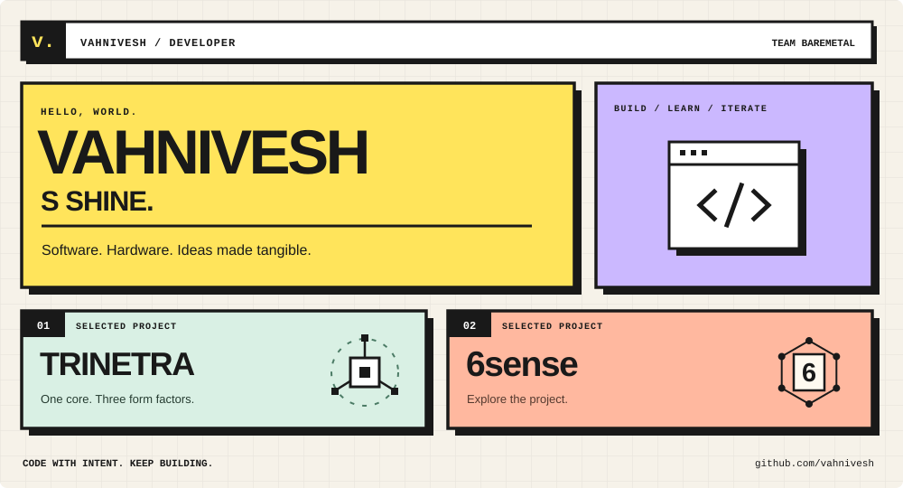
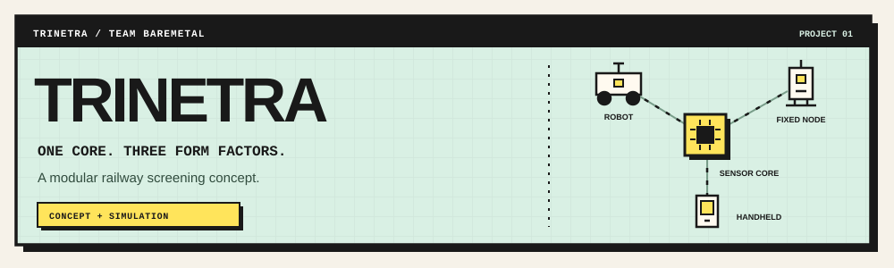
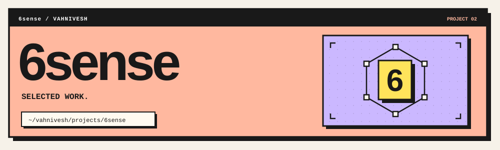

<!--
  GitHub profile: vahnivesh

  Required assets:
  assets/terminal.svg
  assets/trinetra.svg
  assets/6sense.svg

  Confirm the 6sense repository URL before publishing.
-->

<p align="center">
  
</p>

<p align="center">
  <a href="#01--hello-world">About</a>
  &nbsp; / &nbsp;
  <a href="#02--selected-projects">Selected projects</a>
  &nbsp; / &nbsp;
  <a href="#03--developer-mindset">Developer mindset</a>
  &nbsp; / &nbsp;
  <a href="#04--team-baremetal">Team BareMetal</a>
</p>

<p align="center">
  <a href="https://github.com/vahnivesh/Trinetra-BareMetal">
    
  </a>
  &nbsp;
  <a href="https://github.com/vahnivesh/6sense">
    
  </a>
  &nbsp;
  
</p>

<br>

## `01` / Hello, world

I'm **Vahnivesh S Shine**, a programmer and member of **Team BareMetal**.

I'm interested in the space where software meets hardware—how individual components become a useful system, and how thoughtful interfaces make that system easier to understand.

I enjoy turning ideas into something people can explore: code, simulations, and interactive demonstrations that make the engineering visible.

Currently, this profile highlights **Trinetra–BareMetal** and **6sense**.

> Build with curiosity. Improve with evidence.

<br>

## `02` / Selected projects

<br>

<a href="https://github.com/vahnivesh/Trinetra-BareMetal">
  
</a>

### ◉ Trinetra–BareMetal

**A modular railway safety screening concept.**

Railway screening spans moving environments, fixed locations, and focused operator checks. **Trinetra** explores how a shared sensing platform could adapt to these different settings.

Developed with **Team BareMetal**, the concept centres on a **detachable sensor core** proposed for use across three complementary device formats.

| Device format | Intended role |
| :--- | :--- |
| **🤖 Mobile robot** | Carry the sensing core between screening locations. |
| **🖐 Handheld device** | Support focused checks by an operator. |
| **📡 Fixed node** | Support monitoring at a designated location. |

#### The engineering idea

The proposed architecture brings together complementary sensing inputs to support a screening workflow: collect signals, corroborate findings, and present evidence for human review.

It considers **terahertz (THz) sensing** and **volatile organic compound (VOC) sensing** as potential inputs. Their suitability, integration, and performance remain engineering questions to validate.

**Screen → Corroborate → Decision support → Human review**

#### Making the concept tangible

- **Interactive website** — explains the architecture, terminology, and proposed use cases.
- **Simulation** — illustrates the intended screening and review workflow.
- **Device visualisations** — communicate the robot, handheld, and fixed-node formats.
- **Explainer video** — brings the concept and demonstration together.

**Current stage:** an evolving student concept and simulation. The demonstrations communicate intended behaviour; real-world detection performance requires validation.

<p>
  
  
  
  
</p>

<p>
  <a href="https://github.com/vahnivesh/Trinetra-BareMetal">
    
  </a>
  <a href="https://github.com/vahnivesh/Trinetra-BareMetal#readme">
    
  </a>
</p>

<!-- Add verified website, simulation, and explainer video links here. -->

<br>

---

<br>

<a href="https://github.com/vahnivesh/6sense">
  
</a>

### ⌘ 6sense

**Selected project / 02**

**6sense** is the second featured project in my portfolio. Explore its repository for the project overview and implementation.

<!--
  Expand this section once the project details are confirmed:
  - What problem does 6sense address?
  - What are its main features?
  - Which technologies does it use?
  - What has been implemented or demonstrated?
-->

<p>
  <a href="https://github.com/vahnivesh/6sense">
    
  </a>
  <a href="https://github.com/vahnivesh/6sense#readme">
    
  </a>
</p>

<br>

<a href="https://github.com/vahnivesh/HeritagePin-BareMetal">
  
</a>

### HeritagePin

**Selected project / 03**

**HeritagePin** is the second featured project in my portfolio. Explore its repository for the project overview and implementation.

<!--
  Expand this section once the project details are confirmed:
  - What problem does 6sense address?
  - What are its main features?
  - Which technologies does it use?
  - What has been implemented or demonstrated?
-->

<p>
  <a href="https://github.com/vahnivesh/HeritagePin-BareMetal">
    
  </a>
  <a href="https://github.com/vahnivesh/HeritagePin-BareMeta#readme">
    
  </a>
</p>

<br>

## `03` / Developer mindset

```js
const approach = {
  understand: "Start with the problem",
  build:      "Make the idea tangible",
  test:       "Question the assumptions",
  refine:     "Let evidence guide the next version",
  explain:    "Make the engineering understandable",
};
```

I value clear reasoning, useful demonstrations, and honest documentation. A good project should explain what it does, how it works, and what still needs to be tested.

<details>
<summary><b>↳ What I care about when building</b></summary>

<br>

**◎ Understand the setting**  
Start with the people, constraints, and practical problem.

**⚙ Connect the components**  
Think through how hardware, software, and interfaces work together.

**↻ Learn through iteration**  
Use prototypes and feedback to identify the next useful improvement.

**⌘ Communicate the work**  
Make the architecture, progress, and limitations easy to follow.

</details>

<br>

## `04` / Team BareMetal

**Shared curiosity. Collaborative engineering.**

I'm part of **Team BareMetal**, working together on **Trinetra** and bringing different perspectives to the same engineering challenge.

| | |
| :--- | :--- |
| Vahnivesh S Shine | Sarang Warudkar |
| Om Spandan Patnaik | Macha Raghunandan |
| Shreya Nayak | Smitha Mallya |

<p>
  <a href="https://github.com/vahnivesh/Trinetra-BareMetal">
    
  </a>
</p>

<br>

---

<p align="center">
  <code>~/vahnivesh</code>
  <br><br>
  <b>Code with intent. Keep learning. Keep building.</b>
  <br><br>
  <a href="https://github.com/vahnivesh/Trinetra-BareMetal">Trinetra</a>
  &nbsp; · &nbsp;
  <a href="https://github.com/vahnivesh/6sense">6sense</a>
  &nbsp; · &nbsp;
  <a href="https://github.com/vahnivesh">GitHub</a>
</p>
